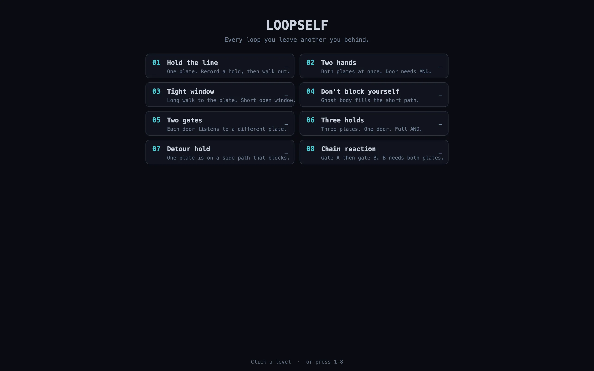
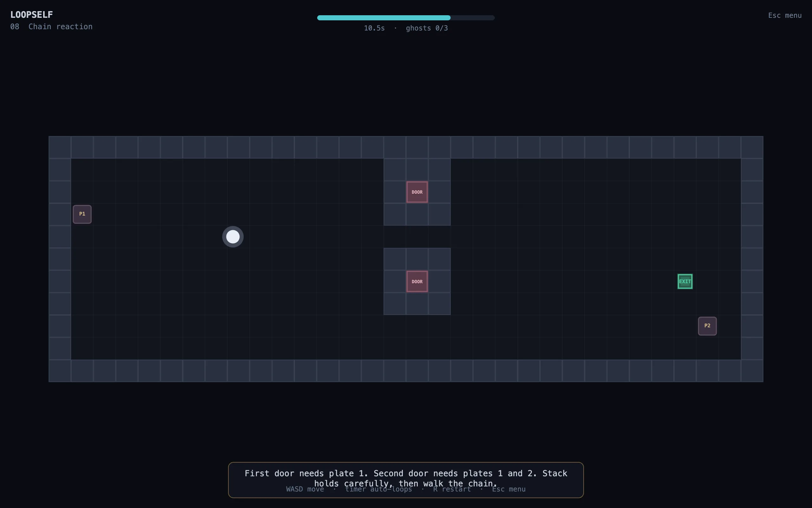

# Loopself

Short time-loop puzzle. Each run lasts a few seconds. When the timer ends, your past self replays as a **ghost**. Hold switches, open doors, and reach the exit by cooperating with earlier versions of yourself.





## Play

For source development, serve the project root with any static file server (ES modules do not load from `file://`), then open the site in a browser.

```bash
# example
python3 -m http.server 8765
```

For a production bundle:

```bash
npm install
npm run build
python3 -m http.server 8765 --directory dist
```

## Controls

| Key | Action |
|-----|--------|
| WASD / arrows | Move |
| R | Hard reset level (wipe all ghosts) / Replay after clear |
| Esc / M | Level select menu |
| 1–8 | Jump to level |
| N | Next level (after clear) |
| Enter / Space | Confirm (intro, clear) |
| Click | Choose level / clear buttons |

## Levels

| # | Name | Idea |
|---|------|------|
| 01 | Hold the line | One plate, record a hold, walk out |
| 02 | Two hands | Two plates AND |
| 03 | Tight window | Long walk — short open window |
| 04 | Don't block yourself | Ghost body blocks the short path |
| 05 | Two gates | Each door listens to a different plate |
| 06 | Three holds | Three plates, full AND |
| 07 | Detour hold | Side-path plate + body block |
| 08 | Chain reaction | Gate A then gate B (B needs both) |

## Stack

- HTML + Canvas 2D + vanilla JavaScript
- esbuild development dependency for the production bundle; no runtime dependencies
- `localStorage` for fewest-ghosts personal bests
- Web Audio for light SFX

## Status

**MVP complete** (Slice A–C): core loop, 8 handcrafted levels, level select, bests, first-boot rules, SFX, loop pulse, win particles, ghost trails.

## License

All rights reserved unless a license file is added later.
